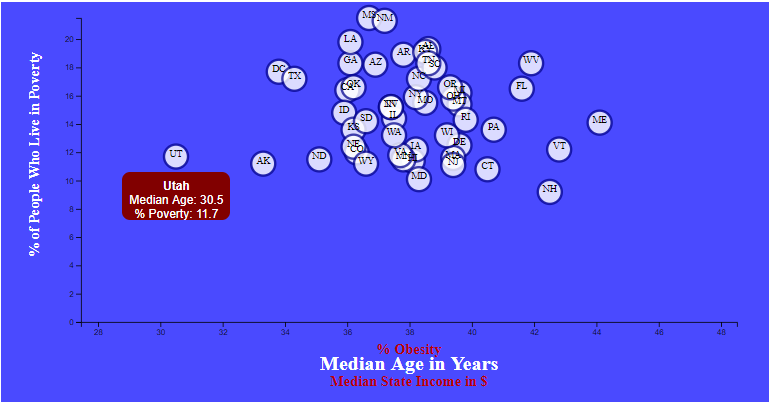

Using a Data Driven Document (D3), I visualize the correlation of the percentage of people in each state who live in poverty to three 
factors: percentage of people that are obese, median age, and median state income. The dynamic proprty of the graph allows a user to 
select the value of the x-axis they want to compare with the poverty percent that is on the y-axis. Also, users can hover the mouse over a 
specific data point to see which state it is and the specific values for that position.

There are several interesting takeaways from this data. The youngest and oldest states, Utah and Maine, are on the lower end of the 
poverty scale. There is a positive correlation between Obesity and Poverty, with Washington DC being an exception. They have the second 
lowest Obesity rate amongst all 50 states but have 17.7% living in poverty. There is no suprise that there is a negative correlation 
between poverty and income; as median state income increases the percent of pople living in poverty decreases. Again Washington DC stands 
out, this time with a tied for second highest income and 17.7% poverty rate.
